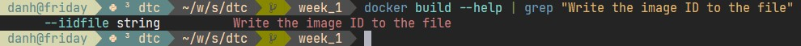
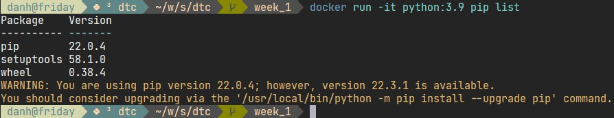

# Week 1

## Overview
There are 3 main components:
- Postgres: Relational database.
- Pgadmin: UI for ease of Postgres manipulation.
- Worker: ETL should be performed here.

## Prerequisite
Docker with compose plugin (current testing version: 20.10.17).

## Instruction
Build and bring system up:
```
mkdir -p pgadmin
sudo chown -R 5050:5050 pgadmin
docker compose build
docker compose up -d
```

## Homework
### Question 1: Which tag has the following text? - Write the image ID to the file
\
**Answer**: --iidfile string

### Question 2: How many python packages/modules are installed in python:3.9 image?
\
**Answer**: 3

### Question 3: How many taxi trips were totally made on January 15?
**Answer**: 20530
```
SELECT COUNT(*)
FROM green_taxi
WHERE lpep_pickup_datetime::date = '2019-01-15'
	AND lpep_dropoff_datetime::date = '2019-01-15'
```

### Question 4: Which was the day with the largest trip distance? Use the pick up time for your calculations.
**Answer**: 2019-01-15
```
SELECT lpep_pickup_datetime::date
FROM green_taxi
GROUP BY lpep_pickup_datetime::date
ORDER BY MAX(trip_distance) DESC
LIMIT 1
```

### Question 5: In 2019-01-01 how many trips had 2 and 3 passengers?
**Answer**: 2: 1282 ; 3: 254
```
SELECT passenger_count, COUNT(*)
FROM green_taxi
WHERE lpep_pickup_datetime::date = '2019-01-01'
	AND (passenger_count = 2 OR passenger_count = 3)
GROUP BY passenger_count
```

### Question 6: For the passengers picked up in the Astoria Zone which was the drop off zone that had the largest tip? We want the name of the zone, not the id.
**Answer**: Long Island City/Queens Plaza
```
SELECT "Zone"
FROM taxi_zone_lookup
WHERE "LocationID" = (
	SELECT "DOLocationID"
	FROM green_taxi
	WHERE "PULocationID" = (
		SELECT "LocationID"
		FROM taxi_zone_lookup
		WHERE "Zone" = 'Astoria'
	)
	GROUP BY "DOLocationID"
	ORDER BY MAX(tip_amount) DESC
	LIMIT 1
)
```
