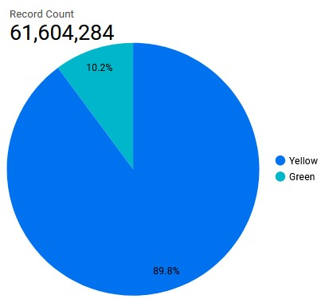
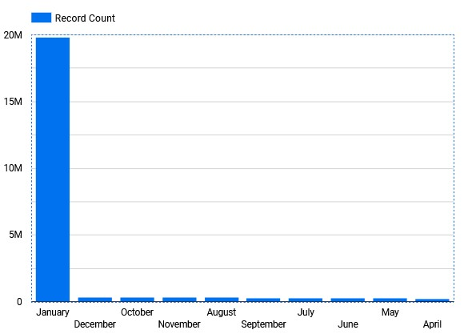

# Week 4

## Overview
This big week discovers DBT.

## Setup

Install DBT :
```
pip install dbt-bigquery
```

Ingest yellow, green and fhv taxi data for both 2019 and 2022 into GCS, BQ:
`web -> GCS -> BigQuery`


## Homework
### Question 1: What is the count of records in the model fact_trips after running all models with the test run variable disabled and filtering for 2019 and 2020 data only (pickup datetime)?
```
SELECT COUNT(*)
FROM `trips_data_all.fact_trips`
```
**Answer**: 
> 61,604,284 (closest with 61,635,329)

### Question 2: What is the distribution between service type filtering by years 2019 and 2020 data as done in the videos?


**Answer**:
> 89.8/10.2 (closest to 89.9/10.1)

### Question 3: What is the count of records in the model stg_fhv_tripdata after running all models with the test run variable disabled (:false)?
```
SELECT COUNT(*)
FROM `dtc-de-375513.trips_data_all.fhv_tripdata_2019`
```
**Answer**:
> 43,244,696

### Question 4: What is the count of records in the model fact_fhv_trips after running all dependencies with the test run variable disabled (:false)?
```
SELECT COUNT(*)
FROM `dtc-de-375513.trips_data_all.fact_fhv_tripdata`
```
**Answer**:
> 22,998,722

### Question 5: What is the month with the biggest amount of rides after building a tile for the fact_fhv_trips table?



**Answer**:
> January

